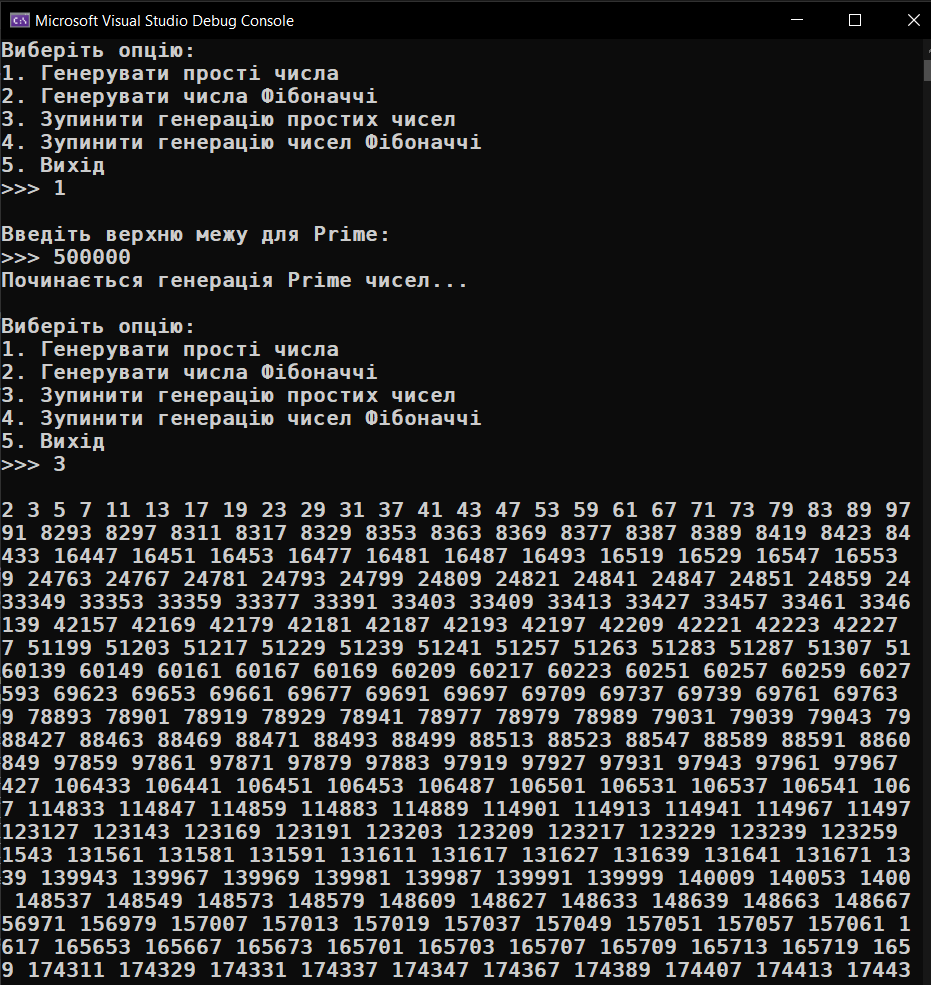
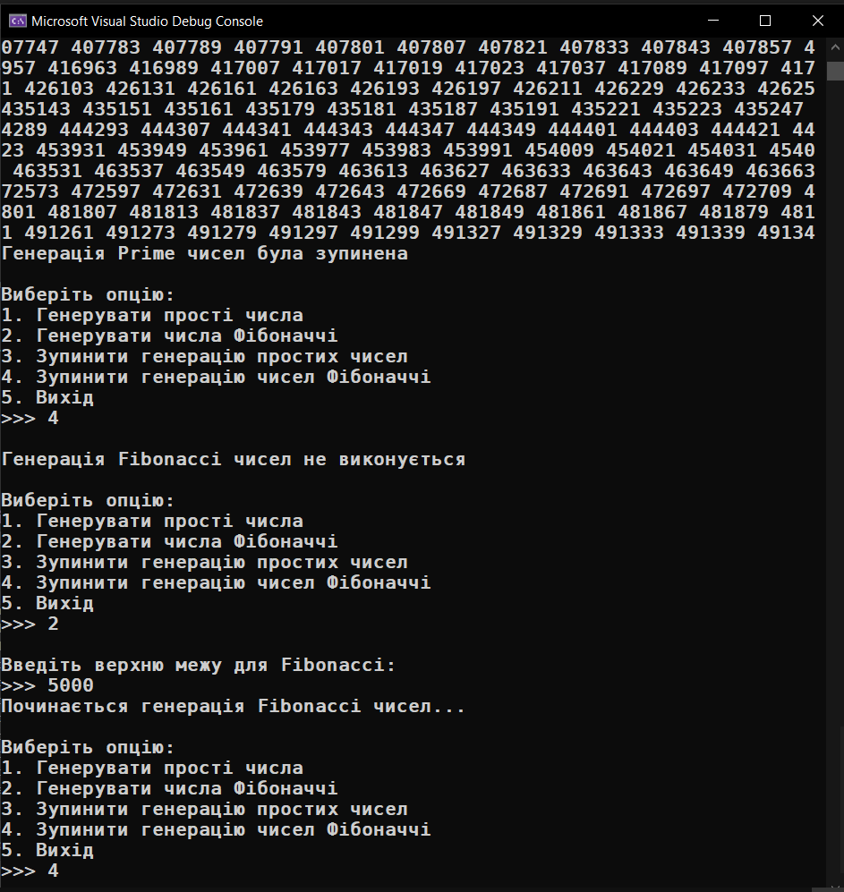
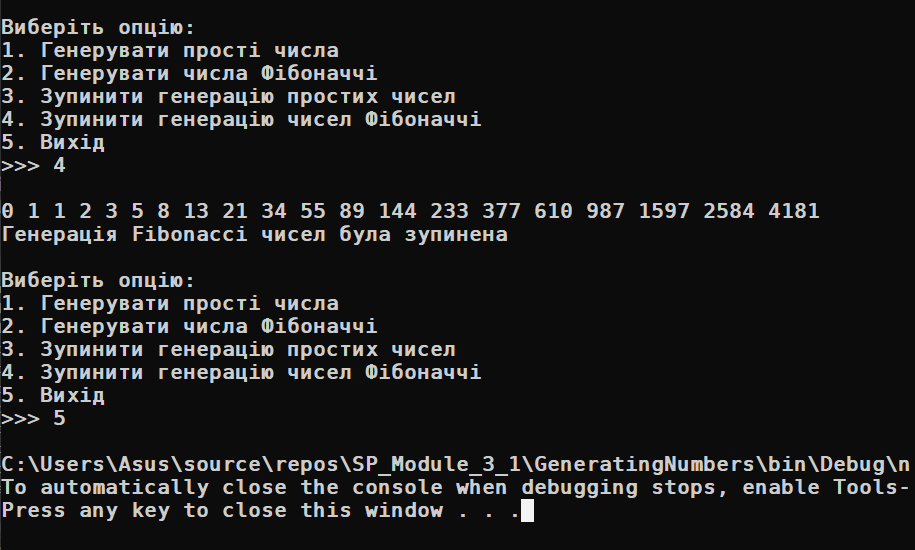

# Module 3_1

<h2>Generating Numbers</h2>

### Добавив папку MyLibs для зручності, у який є [NumberGenerator.dll](MyLibs/NumberGenerator.dll) а також його source code:

- [Program.cs](GeneratingNumbers/Program.cs)
- [MyLibs/](MyLibs)
    * [NumberGeneratorSourceCode/](MyLibs/NumberGeneratorSourceCode/)
        - [NumberGenerator.cs](MyLibs/NumberGeneratorSourceCode/NumberGenerator.cs)
        - [FibonacciGenerator.cs](MyLibs/NumberGeneratorSourceCode/FibonacciGenerator.cs)
        - [PrimeGenerator.cs](MyLibs/NumberGeneratorSourceCode/PrimeGenerator.cs)

